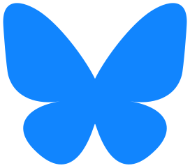

<!--
_class: title
_paginate: false
_header: ""
_footer: ""
-->

# DHUM 25A43 - 01
# Investigating with AI
## Welcome


---


_footer: 'DHUM25A43 - 28/01/25 - https://discord.gg/DDbh5AyHYH'


# Discord


- **#sciencespo-DHUM25A43**
- **https://discord.gg/DDbh5AyHYH**

---

# Meet the teachers

<div class="columns">

<div>

## Andreï Mogoutov
- PhD UPMC 93'
- Data scientist, researcher, consultant
- [andrei.mogoutov@sciencespo.fr](mailto:andrei.mogoutov@sciencespo.fr)

</div>

<div>

## Alexis Perrier
- PhD TelecomParis 95'
- Data scientist, author, teacher
- [alexis.perrier@gmail.com](mailto:alexis.perrier@gmail.com)

   

</div>

</div>

---

<!--
_class: center
-->

# The Course

---

# What is this course about?

**Data Science for Social Sciences**: Applying data science techniques to social science research.

- **Data Search and Collection**: Searching, gathering, and transforming diverse datasets to create corpora and heterogeneous data collections.
- **Exploratory Data Analysis**: Exploring textual content, categories, temporal evolution, extracting names, topics, and their relationships.
- **Qualitative and Quantitative Results**: Combining qualitative insights with quantitative analysis and visual representation of findings.
- **Result Communication**: Presenting outcomes through interactive documents and websites.

---

# Digital investigations with AI for social sciences

- **Powerful LLMs**: Revolutionizing data analysis, interpretation, and automation.
- **Impact on Data Science**: Enhancing efficiency, accuracy, and scalability of workflows.
- **Code Generation with LLM**: Quickly develop data analysis pipelines
- **Use of LLMs as an Autonomous Data Analysis Tool**: extract patterns, trends, and insights from raw data. Analysis of large datasets or documents
- **Accessible Methods**: Simplifying complex data processes with user-friendly tools.

---

# Course Organization

- **Project-Oriented Approach**: Focus on applying concepts through real-world projects.
- **Workshop-Style Sessions**: Interactive, hands-on learning environment.
- **Collaborative Work**: Students work in groups to tackle selected themes and datasets.
- **Practical Focus**: Emphasis on skills development through guided exercises and demos.
- **Professor Assistance**: Direct support and feedback during project work.

---

# Session Structure

**Theoretical Introduction**: Present existing methods (no advanced math or equations) and new AI-assisted approaches.

**Technical Demo**: Showcase practical applications of the methods introduced.

**Practical Student Work**:
- Groups of 3-4 students collaborate on selected themes and datasets.
- Hands-on project development with guidance from professors.

---

# Course Evaluation

- **group note (80%)**
- **public presentation**
- **individual : (20%)**
- **critical reflexion on your work and experience with IA**
- **write a personal SWOT report on your work with AI and propositions**

---

# Course outline - timeline

**We have 12 classes, 2h each**

**We'll cover**
- Background on Web and API
- Data: how to collect and process
- Machine Learning : training models for prediction
- NLP : analyzing text to extract information
- AI & LLMs
- Agents : combining LLMs for agency

---

# Tools

<div class="columns">

<div>

- **[discord](https://discord.gg/DDbh5AyHYH)** for conversations
- **[google drive](https://drive.google.com)** for documents
  - course material
    - ./slides
    - ./data
    - ./colab
  - student projects
    - ./projects
- **[Google colab](https://colab.research.google.com/)** notebooks for work

</div>

<div>

<div class="highlight large center">
All course material is available in google drive and on the discord channel
</div>

</div>

</div>

---

<!--
_class: center
-->

# Course Project

---

# Project Presentation

## Themes
- Climate change, energy
- AI - robotics
- Brain–computer interface
- Other issues…
- Data sources : media, social media, web, scientific publications, specific websites ([COP](https://cop28.com), [IMDB](https://imdb.com), [wikipedia](https://wikipedia.org), Kaggle [datasets](https://kaggle.com/datasets))

**Comment 1** : These topics focus on future-oriented challenges and opportunities

**Comment 2** : The issues are very broad; we need to refine them into precise research questions or subtopics to ensure project feasibility and a reasonable dataset size.

---

# Project Organization

- Find and Formulate Research Questions
- Initial Validation of Projects - Feasibility Check, Relevance
- **Goal: Create a Website**: Design an engaging platform to showcase your report.
- **Creative Formats**: Present findings as a report or in unique forms, such as a movie script or other innovative approaches.
- Publish the website
- Organization: 3 to 4, groups with complementary skills
- Evaluation, expectations
- Primary exposé after a few classes
- Last class: final exposé in front of class and experts

---

# Project

**Start thinking about your project**

**Share your project definition**

**Create your team**

---

<!--
_class: center
-->

# Getting to know you

---

# Please fill out this form

**We'd like to know a bit more about you**

**So that we can adapt the course to meet your expectations**

**All questions are optional (except your email)**

[https://forms.gle/1ksP3qtAk2F5N2gT8](https://forms.gle/1ksP3qtAk2F5N2gT8)

---

<!--
_class: center
-->

# State of AI

---

# A Thorough Recap of 2024

**Things we learned about LLMs in 2024**

by [Simon Willison](https://simonwillison.net/).

<div class="note">
A lot has happened in the world of Large Language Models over the course of 2024. Here's a review of things we figured out about the field in the past twelve months, plus my attempt at identifying key themes and pivotal moments.
</div>

---

# Over 120 new models released in 2024!

**Released Models 2024**
- **Open Source Models: 55**
- **API Only Models: 63**

[**2024 AI Timeline**](https://huggingface.co/spaces/reach-vb/2024-ai-timeline)
*a Hugging Face Space*

---

# Chatbot Arena: LLMs vs LLMs

**Where LLMs compete** [https://lmarena.ai/?leaderboard](https://lmarena.ai/?leaderboard)

<div class="note">
Total #models: 194. Total #votes: 2,557,144. Last updated: 2025-01-20.

Creative Writing: #models: 190 (98%) #votes: 385,176 (15%)
</div>

---

# 2024

**70 models from 18 organizations are now [performing](https://lmarena.ai/?leaderboard) better than GPT4**

- GPT-4 level models run on a laptop (not mine tho)
- Multimodal vision is common, audio and video are starting to emerge
- Prices have dropped => less energy
- EU AI act

---

# Benchmarks

<div class="columns">

<div>

- **The Massive Multitask Language Understanding ([MMLU](https://arxiv.org/abs/2009.03300))** : range of exam questions on academic subjects.
- **[BIG-bench](https://github.com/google/BIG-bench)** : Beyond the Imitation Game
- **[GPQA Diamond](https://arxiv.org/abs/2311.12022)**: harder still, google proof,
  - PhDs domain experts reach 74% accuracy
- **[LiveBench](https://livebench.ai/)**: avoid contamination

and many others
- **[Humanity's Last Exam](https://humanityslastexam.ai/)**
- **[CultureVLM](https://culturevm.ai/)**
- **…**

</div>

<div>

<div class="highlight large">
It's becoming harder to find tasks that are difficult enough for the LLMs.
</div>

**Connections — The New York Times**

</div>

</div>

---

# AI vs Humans (March 2023)

[**How Smart is ChatGPT?**](https://www.maximusai.com/blog/how-smart-is-chatgpt)

<div class="note">
GPT 4.0 has made impressive strides over GPT 3.5 but continues to struggle in certain subjects.

According to OpenAI, the essays that GPT-4 produced for these tests were graded by "qualified third-party contractors".

GPT attempted 10 programming contests 100 times each, but was unable to consistently find solutions to the more complex problems.
</div>

---

# Augmented LLMs

<div class="highlight large center">
It's no longer just about the model
</div>

- 🔍 **Web browsing**
- 📚 **File upload - projects - knowledge base**
- 🧠 **Dynamic memory**
- 👁 **Streaming**
- 🖐 **Function calling**
- 💋 **speech**
- 🥸 **voice**

---

# 2025 ?

<div style="color: red; font-weight: bold;">weekly updates</div>

- Models: DeepSeek-R1, OpenAI o3
- Stargate project ?!
- China vs US
- Massive deployment of AI in all Google and Microsoft services
- Platform evolutions : Anthropic, OpenAI, Gemini, …
  - more features, connections, memory, protocols

---

# 2025 ?

**Ethan Mollick** : [Which AI to Use Now: An Updated Opinionated Guide](https://www.oneusefulthing.org/p/which-ai-to-use-now-an-updated-opinionated)

<div class="note">
Comparison table showing different AI services, their capabilities, and recommended use cases.
</div>

---

<!--
_class: center
-->

# Emergence

---

# Emergence

**Complex systems exhibit properties or behaviors that are not reducible to their individual components.**

<div class="columns">

<div>

**Strong Emergence**: raises the possibility of truly intelligent machines!
- The observed abilities are **genuinely novel**, irreducible to the individual components or algorithms of the LLM.
- the **wetness of water** isn't found in individual water molecules.

**Weak Emergence**: sophisticated but fundamentally different from human intelligence
- The observed abilities can still be **explained** by the underlying mechanisms,
- But their appearance is unexpected and simply difficult to predict.
- ~ modeling **traffic patterns** using the behavior of individual cars.

</div>

<div>


*A termite "cathedral" mound produced by a termite colony offers a classic example of emergence in nature.*

[https://en.wikipedia.org/wiki/Emergence](https://en.wikipedia.org/wiki/Emergence)

</div>

</div>

---

# Emergence - Jason Wei - OpenAI

[**137 emergent abilities of large language models — Jason Wei**](https://arxiv.org/abs/2206.07682)

**As the size of the model increases, we see sudden improvements in its performance on certain tasks**

**for instance 3 digit addition**

**gradually increase size of model**
- errors, errors, …, errors, …

**and then suddenly**
- correct

---

# LLMs you can use

- Gemini (Colab)
- Gemini (aistudio.google.com)
- chatGPT (with memory)
- DeepSeek
- Claude.ai, (create a project)
- Gemini
- LLama
- …

---

<!--
_class: center
-->

# Google Colab

---

# Google Colab

<div class="highlight">
Like google docs but also for executing code

Shareable, collaborative work
</div>

**A notebook is a series of executable cells**
- code (python)
- text with Markdown

[https://colab.research.google.com/](https://colab.research.google.com/)

---

# Text with Markdown

<div class="columns">

<div>

**What you write**

```markdown
Simple Syntax

# Header 1

**this is bold**, not bold

[a link](https://sciencespo.fr)
```

</div>

<div>

**What you get !**

Simple Syntax

# Header 1

**this is bold**, not bold

[a link](https://sciencespo.fr)

</div>

</div>

---

<!--
_class: center
-->

# Demo

---

# Movie Analysis

**The dataset is available in the shared folder in google drive (csv file, google spreadsheet)**

**It contains information of a 1000 movies**
- title
- description
- ranking (imdb, Meta)
- duration
- genres
- actors, director
- revenue

---

# Demo

1. **create a new notebook**
2. **upload the csv file**
3. **ask Gemini to**
   a. load the data
   b. analyze the data
   c. suggest & explain
   d. extract information from the movie description
   e. save the new data
4. **share the notebook**

**Example of analysis notebook:**
[https://colab.research.google.com/drive/1KWmqZRSg7O2gJEWtY8NroUYX68TLkEL9#scrollTo=yoLD0yLL0Phc](https://colab.research.google.com/drive/1KWmqZRSg7O2gJEWtY8NroUYX68TLkEL9#scrollTo=yoLD0yLL0Phc)

---

<!--
_class: center
-->

# Next time

---

# Colab and AI

**In Colab**
- Load a dataset
- prompt Gemini on what questions you can ask on this dataset
- prompt Gemini to create the code to answer your questions

---

# Create your Project

- **Create your team**
- **Define your project**
- **Share your project definition**
- **Announce on the discord channel #sciencespo-dhum25a43 and we will create the related drive folders and subchannels**

---

# Need help ?

1. **Ask an LLM**
2. **We are available on discord**
   a. if possible, please post in the course channel #sciencespo-dhum25a43 not in private messages, so all can contribute