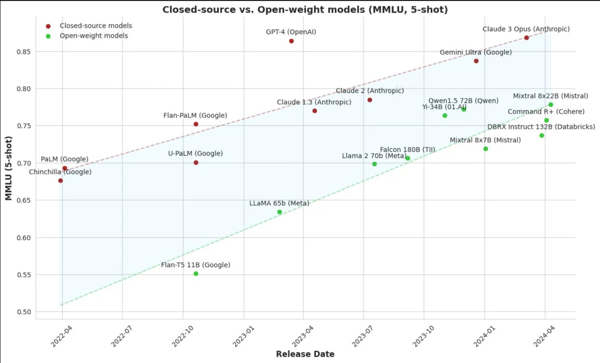
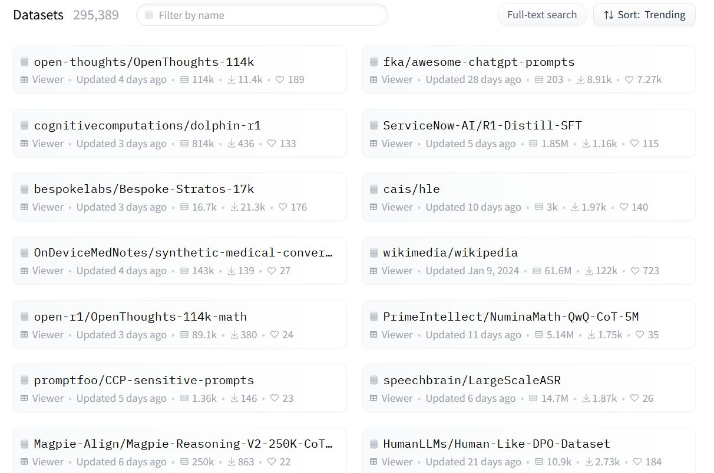

## Investigating with AI

- The Web
- Data formats
- Pandas
- Projects

---

# What we saw last time

- Course
- Projects
- State of AI
- Tools: Colab
- Demo: data analysis using Colab and Gemini

---

# Today

- news review
- open source vs closed source
- data sources
- data formats
- working with pandas
- the web
- Project reviews

- Guided practice: data formats (json, csv) and the python pandas library

---

# At the end of this class

You
- understand what an **API** is
- know the 4 operations in the **REST** protocol
- can edit a **JSON** file

---

<!--
_class: centered
-->

# In the News

What caught your attention?

---

<!--
_class: centered
-->

# Open source vs closed source

---
# Open source vs closed source

A distinction relevant for all software including AI models

<div class="columns">
<div>

Open source:

- The code is public.
- Linux, OpenOffice, Firefox, Chromium, Python, major databases,
- Can be copied and modified by **anyone**


</div>
<div>

Closed source:

- The code is proprietary.
- Windows, Word, Chrome, Edge, Oracle
- needs a license to use, black box

</div>
</div>

---

# Open source is good for:

Since the code is public:

- **Innovation & Flexibility**: Users modify and enhance the software independently. Community-driven development, faster bug fixes, customization of code
- **Security & Transparency**: Security verify there's no virus. Issues are identified and patched quickly by the community.
- **Cost-Effective**: for users: free to use and modify, reduced licensing costs; no vendor lock-in. and for creators: community driven intelligence.

---

And

- **Knowledge Sharing**: Developers learn from existing code, accelerating skill development and innovation, shared knowledge and best practices.
- **Long-term Viability**: the community keeps on improving the software long after the initial devs have left the project

---

# Open source LLMs

Different levels of openness:

- **model** : you can download the model and use it as is
- **code**: the code to create the model
- **training data**: the data used in training the model

Some models are fully open (DeepSeek), partially open (**LLama**, Mistral 7B), or closed (OpenAI o1, Claude Sonnet, Gemini)

If you have the weights of a model you can fine tune it on your own data. Light version of training a whole model

---

# Recent open source

<div class="small">

| Model / Family                 | Date   | Company                        | Key Highlights                                             |
| ------------------------------ | -------------- | ------------------------------ | ---------------------------------------------------------- |
| **GPT-OSS-120B / 20B**         | Aug 2025       | **OpenAI**                     | Open-weight MoE models; long context; consumer-friendly    |
| **Llama 4 (Scout, Maverick)**  | April 5, 2025  | **Meta**                       | Mixture-of-experts; multimodal; long context; multilingual |
| **DeepSeek-R1**                | Jan 2025       | **DeepSeek**                   | Strong reasoning & math performance                        |
| **Gemma 3**                    | March 12, 2025 | **Google DeepMind**            | Multimodal, multilingual, long-context                     |
| **Qwen 2.5 (VL-32B, Omni-7B)** | March 2025     | **Alibaba (Qwen Team)**        | Vision–language and multimodal capabilities                |
| **Qwen 3 family**              | April 28, 2025 | **Alibaba (Qwen Team)**        | Dense & sparse variants up to 235B                         |
| **Mistral Small 3.1**          | March 2025     | **Mistral AI**                 | Efficient small-scale open model                           |
| **Magistral Small**            | June 10, 2025  | **Mistral AI**                 | Reasoning-focused, chain-of-thought tuned                  |
| **GLM-4.5**                    | July 2025      | **Zhipu AI**                   | Agent-oriented model                                       |
| **BitNet b1.58 2B4T**          | April 2025     | **Microsoft Research**         | 1-bit quantized, ultra-efficient                           |
| **AM-Thinking-v1**             | May 2025       | **Academind / Qwen community** | Qwen-based advanced reasoning model                        |

</div>


---




---

| Term                              | means Explanation                                                                                                                                                                                                       |
| --------------------------------- | ------------------------------------------------------------------------------------------------------------------------------------------------------------------------------------------------------------------------ |
| **Multimodal**                    | The model can understand inputs like text **and** images (sometimes also audio/video) rather than just one type. |
| **MoE** <br /> Mixture-of-Experts  | An architecture where different _experts_  models handle different parts of the task—only a few experts activate per input  |
| **Long context**                  | The model can remember and work with very long passages of text (think chapters or entire books) without forgetting what was at the start. 1M tokens |
| **Multilingual**                  | The model understands and can respond in many different languages, not just English. |
| **Efficient / Consumer-friendly** | Designed to run on regular devices (like a powerful laptop or single GPU) without needing massive data center infrastructure.       |


---
<!--
_class: centered
-->

# Datasets & datasources

---

# Datasets & datasources

**News and Media**: Newspaper archives (NYT, ...), Youtube (yt-dlp), websites
**Scholarly and Scientific Articles**: Academic journals, repositories like PubMed, arXiv, JSTOR.
**Encyclopedic and Knowledge Bases**: Wikipedia / Wikidata, Encyclopedia Of Science Fiction
**Entertainment and Cultural Datasets**: IMDb for film and television data, GoodReads
**Government and Legislative Data**: Parliamentary records, government publications, election results
**Consumer Reviews**: Amazon Reviews, CellarTracker
**Social networks**: Facebook, Twitter, Instagram, TikTok, YouTube, Telegram,


---

# Kaggle datasets

Obtain and analyze an existing CSV dataset for the project.


NYT Articles: 2.1M+ (2000-Present) Daily Updated
NYT Articles: Small Processed 500k Version

IMDB Dataset of 50K Movie Reviews

arXiv Dataset


[https://www.kaggle.com/datasets](https://www.kaggle.com/datasets)

---


 Hugging Face datasets interface with 295,389 datasets and various dataset examples

[https://huggingface.co/datasets](https://huggingface.co/datasets)

---

# Google datasets search engine

[https://datasetsearch.research.google.com/](https://datasetsearch.research.google.com/)

---

# Literature

GoodReads 100k books

GoodReads Best Books


Encyclopedia Of Science Fiction


GitHub - sindresorhus/awesome-scifi: Sci-Fi worth consuming


GitHub - RichardLitt/awesome-fantasy: :european_castle: Fantasy literature worth reading

---
<!--
_class: centered
 -->
# JSON

---

# Beyond html: JSON

There are multiple API standards and languages

And APIs can return all sorts of content: html, text, xml, pdfs,

APIs often return raw data formatted as **JSON**

**JSON** (JavaScript Object Notation) is a lightweight data format.

- easy for humans to read and write.
- easy for machines to parse and generate.

---

# Here's an example

```json
{
  "volume": "blaring",
  "current" : {
    "band": "rednex",
    "song": "cotton eye joe",
    "members":[
      {"firstname":"Kent","lastname":"Olander"},
      {"firstname":"Urban","lastname":"Landgren"},
      {"firstname":"Jonas","lastname":"Lundstrom"},
      {"firstname":"Tor","lastname":"Nilsson"}
    ]
  },
  "next" : {
    "band": "the dubliners",
    "song": "finnegan's wake",
    "members":[
      {"firstname":"Ronnie","lastname":"Drew"},
      {"firstname":"Luke","lastname":"Kelly"},
      {"firstname":"Ciaran","lastname":"Bourke"},
      {"firstname":"Barney","lastname":"McKenna"}
    ]
  }
}
```

---

# How do you edit a JSON file ?

- do not use `word` or `google docs`. these are for real human text not data
- use a code editor such as vscode (but it's overkill for just editing JSON)

- An online JSON formatter and editor is a good alternative
  - [https://jsoneditoronline.org/](https://jsoneditoronline.org/)
  - and many others

---

# csv

comma separated values

in France, we use ; as a separator because numbers use , as a decimal separator

---

# pandas

THE library to handle data.

Loads  a csv file into a dataframe

A dataframe is exactly like a spreadsheet. columns and rows

```python
import pandas as pd

df = pd.read_cv('titanic.csv')

```

---

# basic manipulations

```python
print(df)
df.head()
df.tail()
df.columns
df.dtypes
df.shape
df.describe()
df.isnull().sum()
df.isnull().mean()
df.isnull().sum() / df.shape[0]
df.isnull().sum() / df.shape[0] * 100
df.isnull().sum() / df.shape[0] * 100
```

---

# Selecting columns

```python
df['column_name']
df[['column_name1', 'column_name2']]
df.loc[:, 'column_name1':'column_name2']
df.iloc[:, 0:2]
```

---

# Selecting rows

```python
df['column_name']
df[['column_name1', 'column_name2']]
df.loc[:, 'column_name1':'column_name2']
df.iloc[:, 0:2]
```

---

calculations on the titanic dataset

```python
df['column_name'].mean()
```

---
<!--
_class: centered
 -->

# Pandas Practice


---

# demo

---


---
<!--
_class: centered
 -->
# Projects


---

# Projects

Let's review your projects

fill in the google spreadsheet for projects

- team
- project title
- project description
- data source