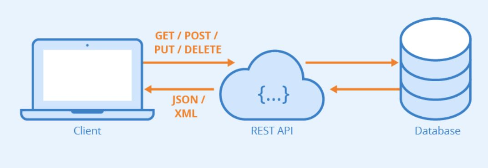
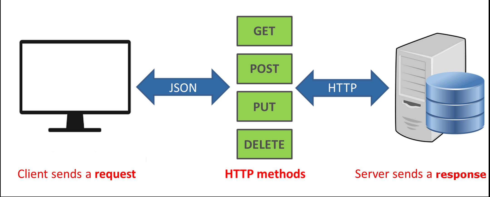
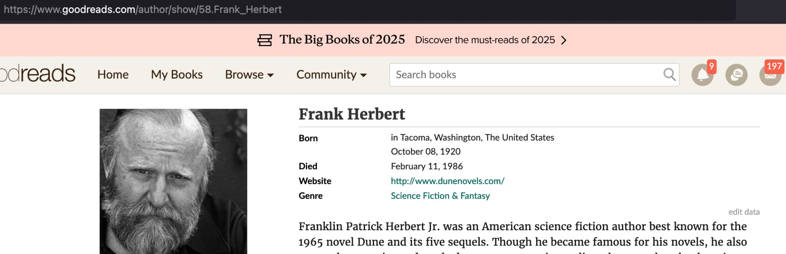
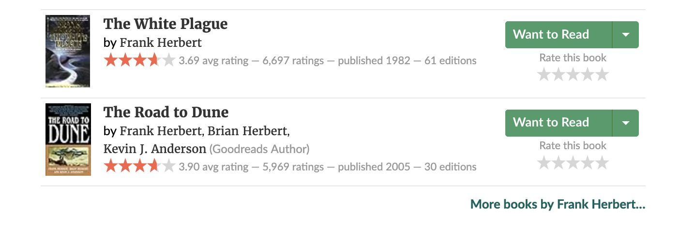
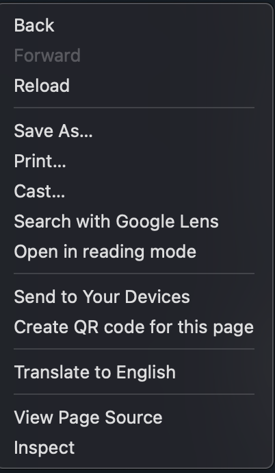
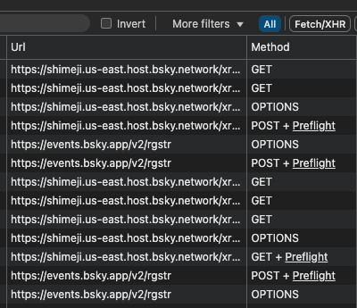

<!--
_class: centered
 -->

# API
## Application Programming Interface


---

# What we saw last time

- open source vs closed source
- data sources
- data formats
- Project reviews

---

# Today

- news review
- open source vs closed source
- data sources
- data formats
- Project reviews

- Guided practice: data formats (json, csv) and the python pandas library

---

# At the end of this class

You
- understand what an **API** is
- know the 4 operations in the **REST** protocol
- can edit a **JSON** file

---

<!--
_class: centered
-->

# In the News

What caught your attention this week?


---

# API

**A generic definition**

An API is a connection between **computers** or between **computer programs**.
It is a type of software **interface**, offering a service to other pieces of **software**.
In contrast to a user interface, which connects a computer to a person


**A more practical definition**

An API defines the **methods** and **data** formats
that **applications** can use
to **request and exchange** information.

---

# API

1. You send a request to a web address : a url
2. The server answers the request
3. You get back some data



---

# Four verbs to rule the world

- GET : read the data
- POST : create the data
- PUT : update the data
- DELETE : delete the data

The whole digital economy is based on these 4 words!

---
# Example

- you read your feed: GET
- you like a post : POST
- you remove a reel : DELETE
- you update your profile : PUT

---

<div class="boom">
The Web is One BIG API + GET requests
</div>

1. on your browser you go to a url. This is the initial GET request
2. that request triggers a call to the server.
3. the server sends you back the html page as the response



---

<!--
_class: centered
-->

# The Web is an API
## Let's illustrate

---

# The web is one gigantic API
It uses URLs to send requests to a server

The server sends the html page back

- Go on https://goodreads.com
- Search for **Dune**
- Click on the author's name Frank Herbert

You should end up on this URL:

https://www.goodreads.com/author/show/58.Frank_Herbert

---

# What's a URL ?

A URL (Uniform Resource Locator) is the address of a unique resource on the internet.

domain name + everything else to specify the data you requested

```
https://{domain name}/{endpoint}?{params}
```

---

**Example**

https://www.goodreads.com/author/**show**/58.Frank_Herbert

- **show** an author,
- with label **58.frank.herbert**



---

# /list instead of /show

Now scroll down and click on "More Books by Frank Herbert"


---

# /list instead of /show

The URL is now https://www.goodreads.com/author/**list**/58.Frank_Herbert

The verb "**/show**" is replaced with the verb "**/list**".




---

# Parameters: ?page=2&per_page=30

Now click on page 2

The URL becomes
https://www.goodreads.com/author/list/58.Frank_Herbert**?page=2&per_page=30**

which reads
- list all the works of author 58.Frank_Herbert
- show page 2
- and show only 30 works per page

---

# REST is the building block of the internet

An endpoint: an URL and a path

Parameters: ?page=2&per_page=30

A method : here the method is to GET the page

The html page as the server response

---


<div class="columns">
<div>
# DEV tools - under the hood

go on a social network and like a post
- click right and get to the developpers tools : inspect
- click on network tab
- like a post: you should see a request with method POST
- click on a post: you should see a requests with method GET

</div>
<div>



</div>
</div>

---

# Exercise

grab a screenshot of the Devtools screen

paste in a LLM like chatGPT or Claude or ...

ask: explain in simple terms what I'm seeing

---




---
<!--
_class: centered
 -->

# Wikipedia API

---

# The wikipedia API

Check out :

- The API documentation https://www.mediawiki.org/wiki/API:Main_page
- The wikipedia python library:
  https://wikipedia.readthedocs.io/en/latest/code.html
- AI studio: https://aistudio.google.com or chatGPT as an alternative to
  generate code
- The sandbox : https://en.wikipedia.org/wiki/Special:ApiSandbox
